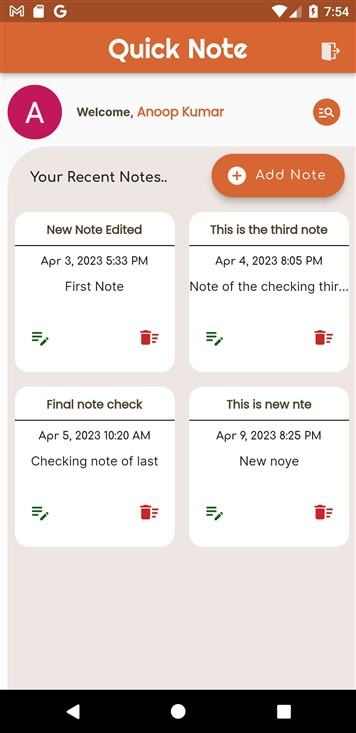

# Quick Note App

Flutter Note Saving Application with Firebase Database

## UI Screenshot

, 

## Packages

cloud_firestore: ^4.4.4 [Click Here](https://pub.dev/packages/cloud_firestore)

firebase_core: ^2.7.1 [Click Here](https://pub.dev/packages/firebase_core)

easy_splash_screen: ^1.0.4 [Click Here](https://pub.dev/packages/easy_splash_screen)

firebase_database: ^10.0.16 [Click Here](https://pub.dev/packages/firebase_database)

firebase_auth: ^4.2.10[Click Here](https://pub.dev/packages/firebase_auth)

firebase_auth_web: ^5.2.10[Click Here](https://pub.dev/packages/firebase_auth_web)

shared_preferences: ^2.0.20[Click Here](https://pub.dev/packages/shared_preferences)

intl: ^0.17.0[Click Here](https://pub.dev/packages/intl)

flutter_typeahead: ^4.3.7[Click Here](https://pub.dev/packages/flutter_typeahead)

